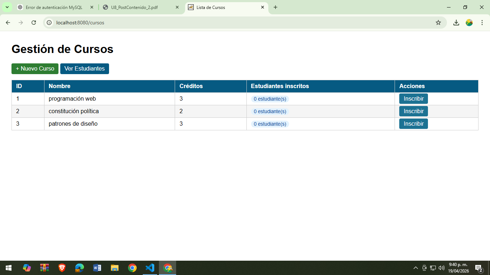
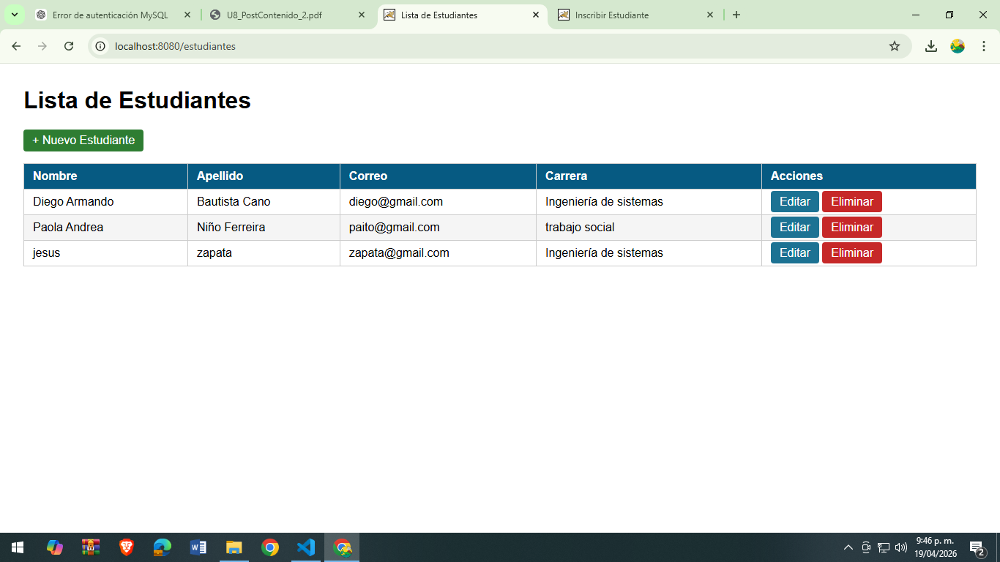
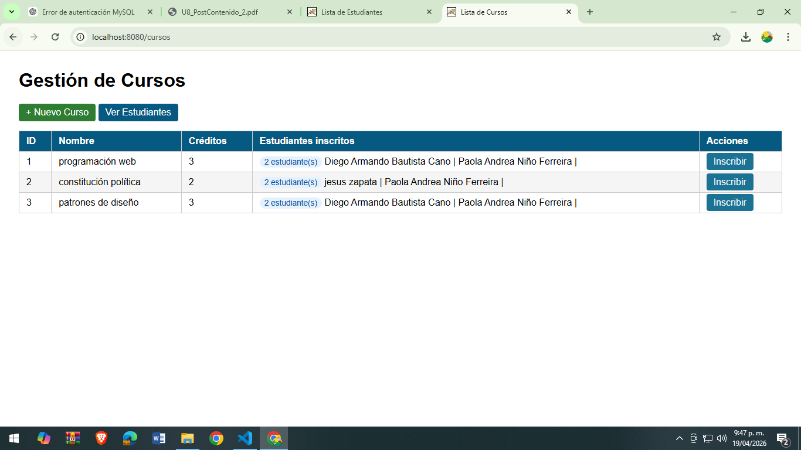
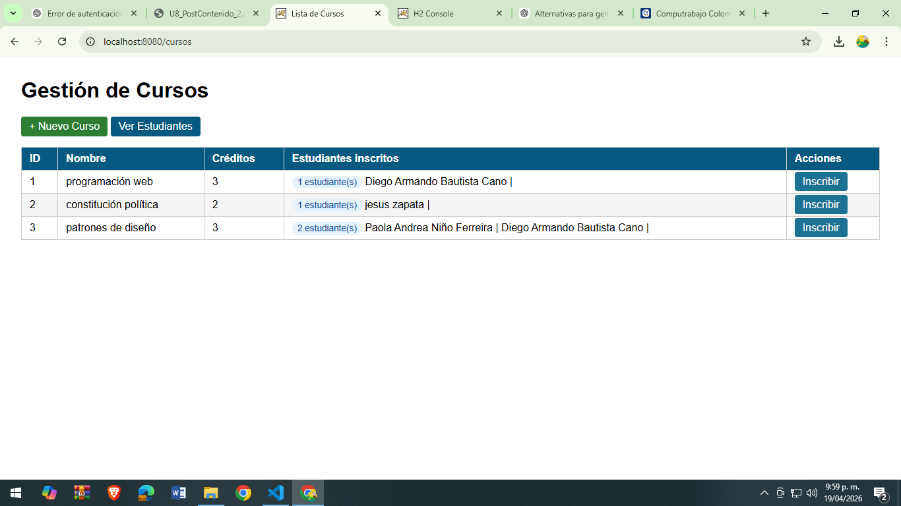

# 🎓 Sistema de Gestión de Estudiantes y Cursos (Spring Boot)

## 📌 Descripción del proyecto

Este proyecto es una aplicación web desarrollada con **Spring Boot**, que permite gestionar estudiantes y cursos, incluyendo su relación de inscripción (muchos a muchos).

El sistema permite:
- Crear cursos
- Crear estudiantes
- Inscribir estudiantes en cursos
- Desinscribir estudiantes de cursos
- Visualizar la cantidad de estudiantes por curso
- Ver la relación en la base de datos (H2)

La base de datos utilizada es **H2 en memoria**, por lo que no requiere instalación de MySQL.

---

## ⚙️ Tecnologías utilizadas

- Java 17
- Spring Boot
- Spring MVC
- Spring Data JPA
- Hibernate
- Thymeleaf
- H2 Database
- Maven

---

## 🚀 Instrucciones de ejecución

### 1. Ejecutar el proyecto

En la terminal del proyecto:

```bash
./mvnw spring-boot:run

## 📸 Evidencias del proyecto

### 🧑‍🎓 Crear estudiante


---

### 🧑‍🎓 Crear estudiantes


---

### 📚 Crear cursos


---

### 🔗 Inscribir estudiantes en cursos


---

### ❌ Desinscribir estudiante


Autor
Diego Armando Cayetano Bautista Cano
